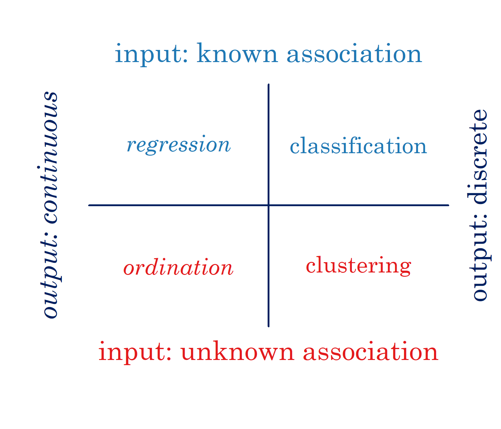

```{r xaringan-themer, include=FALSE, warning=FALSE}
library(xaringanthemer)
style_mono_accent(base_color = "#002060",
                  text_color = "#002060",
                  header_h1_font_size = "2.75rem",
                  header_h2_font_size = "2.25rem",
                  header_h3_font_size = "1.5rem",
                  text_font_size = "1.25rem",
                  footnote_font_size = "0.6em",
                  header_font_google = google_font("Libre Baskerville", "700b"),
  text_font_google   = google_font("Libre Baskerville", "400"),
  code_font_google   = google_font("Arvo"),
  footnote_color = "#002060",
  footnote_position_bottom = "15px; position: absolute; bottom: 1em; left: 1em"
  )
```
class: heading-slide, middle, center
background-image: url("NurlanDauletbayev_BackgroundImage_2023-12-21.png")
background-size: cover

# Introduction to

# "Machine Learning in Medicine"

## Nurlan Dauletbayev

### Philipps-University of Marburg

.footnote[21/12/2023]

---
background-image: url("NurlanDauletbayev_SecondPageImage_2023-12-21.png")
background-size: cover

```{css, echo=FALSE}
.remark-slide-content > h2{
  font-size: 36px;
  margin-top: 5px;
  margin-left: -40px
}
```

## Course layout



.pull-left[
.tiny[figure modified from: https://www.quantitative-biology.ca/multi.html]
]

.footnote[N. Dauletbayev, 21/12/2023]

--

background-image: url("NurlanDauletbayev_SecondPageImage_2023-12-21.png")
background-size: cover

.pull-right[
**Important Comment**
.content-box-gray[
> As with everything, there are exceptions. For example,
logistic *regression* is typically used for classification,
and the output of some clustering methods (e.g., fuzzy
clustering) can resemble continuous scale
]
]

.pull-left[
.tiny[figure modified from: https://www.quantitative-biology.ca/multi.html]
]

.footnote[N. Dauletbayev, 21/12/2023]

---

background-image: url("NurlanDauletbayev_SecondPageImage_2023-12-21.png")
background-size: cover

## Course layout

| Group | Discussed techniques |
|------------|----------------------------------------|
| Ordination | PCA, cMDS, non-metric MDS, t-SNE, UMAP |
| Clustering | hierarchical clustering, partitional clustering, fuzzy clustering |
| Regression | Linear regression, logistic regression |
| Classification | Logistic regression, random forest |

.footnote[N. Dauletbayev, 21/12/2023]
